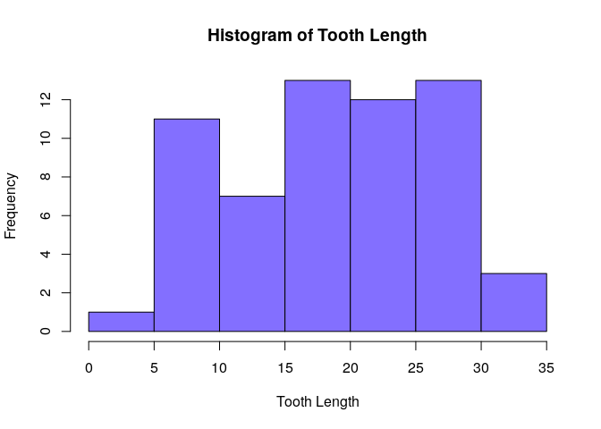
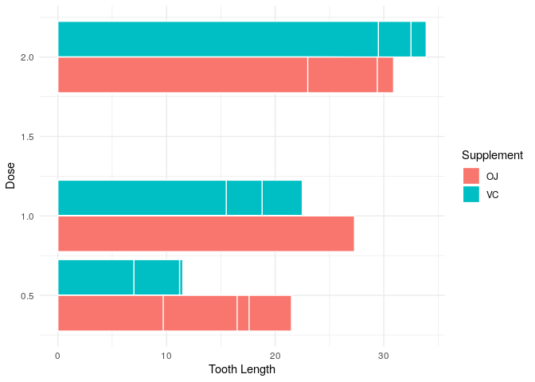

Tooth Growth Analysis
================

In this project, we are going to explore the ToothGrowth R dataset and
do inferential data analysis aiming to answer the following questions:

1 - Is there a relation between tooth length and supplement used?

2 - Does changing the supplement dosage interfere with the tooth length?

The project is set in literate programming, allowing full research
reproducibility.

## Tools Used

  - R language compiler
  - R base graphic devices
  - Tidyverse library packages
  - RMarkdown library package
  - Knitr library
    package

## Files

  - **[CODEBOOK](https://github.com/vcwild/tooth-growth/blob/master/analysis.pdf)**:
    step-by-step book explaining the code
    processing.
  - **[Figures](https://github.com/vcwild/tooth-growth/tree/master/analysis_files/figure-gfm)**:
    the plotted
    images
  - **[Infsim.Rmd](https://github.com/vcwild/tooth-growth/blob/master/analysis.Rmd)**:
    the script to compile the project from source

## CODEBOOK

## Setup

``` r
knitr::opts_chunk$set(echo = TRUE, cache = TRUE, warning = FALSE)
```

### Provide a basic summary of the data

Loading required packages and data
    set

``` r
require(tidyverse)
```

    ## Loading required package: tidyverse

    ## ── Attaching packages ───────────────────────────────────────────────────────────────────────────────── tidyverse 1.3.0 ──

    ## ✓ ggplot2 3.3.0     ✓ purrr   0.3.4
    ## ✓ tibble  3.0.1     ✓ dplyr   0.8.5
    ## ✓ tidyr   1.0.2     ✓ stringr 1.4.0
    ## ✓ readr   1.3.1     ✓ forcats 0.5.0

    ## ── Conflicts ──────────────────────────────────────────────────────────────────────────────────── tidyverse_conflicts() ──
    ## x dplyr::filter() masks stats::filter()
    ## x dplyr::lag()    masks stats::lag()

``` r
data <- ToothGrowth
```

## Exploratory Data Analysis

### Summary of the data

``` r
means <- data %>% 
    group_by(supp, dose) %>% 
    summarize(tooth.length = mean(len))

means
```

    ## # A tibble: 6 x 3
    ## # Groups:   supp [2]
    ##   supp   dose tooth.length
    ##   <fct> <dbl>        <dbl>
    ## 1 OJ      0.5        13.2 
    ## 2 OJ      1          22.7 
    ## 3 OJ      2          26.1 
    ## 4 VC      0.5         7.98
    ## 5 VC      1          16.8 
    ## 6 VC      2          26.1

``` r
# Classes
nclass = round(sqrt(length(data$len)))
hist(data$len, col = "slateblue1", main = "Histogram of Tooth Length", xlab = "Tooth Length", nclass = nclass)
```

<!-- -->

``` r
# OJ - orange juice
# VC - vitamin C
```

## Inferential Analysis

### Use confidence intervals and/or hypothesis tests to compare tooth growth by supp and dose

#### Hypotesis 1 - Relation between tooth length and the supplement used

``` r
# Separate value vectors for analysis
supp = data$supp

len_by_OJ = data$len[supp == "OJ"] # Mean
len_by_VC = data$len[supp == "VC"]

# T-test: non-paired, variance based on approx of df, t < mean
t.test(len_by_VC, len_by_OJ, conf.level = .95, var.equal = FALSE, paired = FALSE, alternative = "less")
```

    ## 
    ##  Welch Two Sample t-test
    ## 
    ## data:  len_by_VC and len_by_OJ
    ## t = -1.9153, df = 55.309, p-value = 0.03032
    ## alternative hypothesis: true difference in means is less than 0
    ## 95 percent confidence interval:
    ##        -Inf -0.4682687
    ## sample estimates:
    ## mean of x mean of y 
    ##  16.96333  20.66333

The p-value shows strong evidence to reject the null hypothesis (pval \<
0.05), indicating there is correlation between the tooth length and the
supplement used.

### Hypothesis Conclusion

We can confirm with a 95% confidence interval that the tooth length by
using Vitamin C across all dosages is less than that of Orange Juice,
implying that the tooth length is directly affected by the supplement
used.

#### Hypothesis 2 - Comparing tooth growth by dose

``` r
# Separate value vectors for analysis
half = data$len[data$dose == .5]
one = data$len[data$dose == 1] # Mean
two = data$len[data$dose == 2]

# Dose one is considered the mean sample for testing

# T-test, non-paired, var by approx of df, t < mean
t.test(half, one, alternative = "less", paired = FALSE, var.equal = FALSE, conf.level = .95)
```

    ## 
    ##  Welch Two Sample t-test
    ## 
    ## data:  half and one
    ## t = -6.4766, df = 37.986, p-value = 6.342e-08
    ## alternative hypothesis: true difference in means is less than 0
    ## 95 percent confidence interval:
    ##       -Inf -6.753323
    ## sample estimates:
    ## mean of x mean of y 
    ##    10.605    19.735

The p-value shows strong evidence to reject the null hypothesis (pval \<
0.05), indicating there is correlation between lower supplement doses
and tooth length.

``` r
# T-test, non-paired, var by approx of df, t > mean
t.test(two, one, alternative = "greater", paired = FALSE, var.equal = FALSE, conf.level = .95)
```

    ## 
    ##  Welch Two Sample t-test
    ## 
    ## data:  two and one
    ## t = 4.9005, df = 37.101, p-value = 9.532e-06
    ## alternative hypothesis: true difference in means is greater than 0
    ## 95 percent confidence interval:
    ##  4.17387     Inf
    ## sample estimates:
    ## mean of x mean of y 
    ##    26.100    19.735

The p-value shows strong evidence to reject the null hypothesis (pval \<
0.05), indicating there is correlation between higher supplement doses
and tooth length.

### Hypothesis Conclusion

We can confirm with a 95% confidence interval that the supplement dosage
rate interferes with tooth growth.

We can visualize this statement as the plot shows:

``` r
ggplot(data, aes(dose, len, group = supp, fill = supp)) +
    geom_bar(stat = "identity", position = "dodge", color = "white") +
    labs(
        x = "Dose",
        y = "Tooth Length",
        fill = "Supplement"
    ) +
    coord_flip() +
    theme_minimal()
```

<!-- -->
